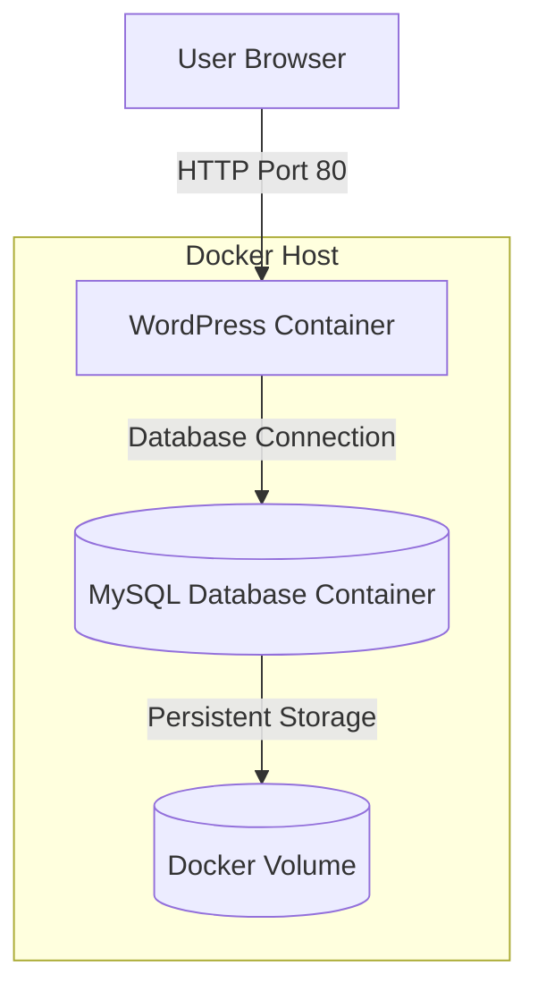

# Docker Compose Complete Lab Guide

## Objective

Learn:
- What Docker Compose is
- Why Docker Compose is used
- How to deploy multi-container applications
- How containers communicate using Compose
- How volumes and networks work automatically

---

# What is Docker Compose?

***Docker Compose*** is a tool used to define and manage multiple containers using a single YAML file.

Instead of running many `docker run` commands manually, we write everything inside:

```yaml
docker-compose.yaml
```

and start all services together using:

```bash
docker-compose up
```

---

# Why Docker Compose?

Without Compose:
- We must create containers one by one
- Create networks manually
- Create volumes manually
- Link containers manually

With Compose:
- Everything is automated
- Infrastructure becomes reusable
- Easy for DevOps and CI/CD

---


# Architecture Diagram



---

# Docker Compose Workflow


---

# Lab Prerequisites

Install:
- Docker
- Docker Compose

Check Docker:

```bash
docker --version
```

Check Docker Compose:

```bash
docker-compose --version
```

---

# Task 1 — Install Docker Compose

## Ubuntu Installation

```bash
apt update -y
```

## Install Python3

```bash
apt install python3 -y
```

## Install pip

```bash
apt install python3-pip -y
```

## Install Docker Compose

```bash
pip3 install docker-compose
```

---

# Verify Installation

```bash
docker-compose --version
```

Expected Output:

```text
docker-compose version 1.x.x
```

---

# Task 2 — Create Project Directory

## Create directory

```bash
mkdir wordpress
```

### Explanation

This directory will contain:
- docker-compose.yaml
- Application configuration

---

## Move into directory

```bash
cd wordpress
```

---

# Task 3 — Create Compose File

## Create YAML file

```bash
vi docker-compose.yaml
```

---

# Paste the Following Configuration

```yaml
version: '3.3'

services:

  # MySQL Database Container
  db:
    image: mysql:5.7

    # Persistent storage for database
    volumes:
      - db_data:/var/lib/mysql

    restart: always

    environment:
      MYSQL_ROOT_PASSWORD: somewordpress
      MYSQL_DATABASE: wordpress
      MYSQL_USER: wordpress
      MYSQL_PASSWORD: wordpress

  # WordPress Application Container
  wordpress:

    # Start db container first
    depends_on:
      - db

    image: wordpress:latest

    ports:
      - "80:80"

    restart: always

    environment:
      WORDPRESS_DB_HOST: db:3306
      WORDPRESS_DB_USER: wordpress
      WORDPRESS_DB_PASSWORD: wordpress
      WORDPRESS_DB_NAME: wordpress

# Named Volume
volumes:
  db_data: {}
```

---

# Theory of Compose File

## version

```yaml
version: '3.3'
```

Defines Compose file format version.

---

## services

```yaml
services:
```

All containers are defined under services.

Here:
- db → MySQL container
- wordpress → WordPress container

---

## image

```yaml
image: mysql:5.7
```

Pulls image from Docker Hub.

---

## volumes

```yaml
volumes:
  - db_data:/var/lib/mysql
```

Purpose:
- Data persistence
- Database data survives container deletion

---

## environment

Used to pass environment variables into container.

Example:

```yaml
MYSQL_ROOT_PASSWORD
```

sets MySQL root password.

---

## depends_on

```yaml
depends_on:
  - db
```

Ensures WordPress starts after MySQL container.

---

## ports

```yaml
ports:
  - "80:80"
```

Maps:
- Host Port → Container Port

Format:

```text
HOST:CONTAINER
```

---

## restart

```yaml
restart: always
```

Automatically restarts container if:
- Container crashes
- Server reboots

---

# Task 4 — Start Application

## Run Compose

```bash
docker-compose up -d
```

---

# Explanation

## up

Creates and starts:
- Containers
- Networks
- Volumes

## -d

Runs containers in detached/background mode.

---

# Expected Activities

Docker Compose will:
1. Pull images
2. Create network
3. Create volume
4. Create containers
5. Start services

---

# Task 5 — Verify Containers

## Check Compose containers

```bash
docker-compose ps
```

---

# Check running containers

```bash
docker container ls
```

---

# Check networks

```bash
docker network ls
```

Expected:
- A new compose network

Example:

```text
wordpress_default
```

---

# Check volumes

```bash
docker volume ls
```

Expected:
- Named volume

Example:

```text
wordpress_db_data
```

---

# Task 6 — Access WordPress

Open browser:

```text
http://<SERVER-IP>
```

or locally:

```text
http://localhost
```

You should see:
- WordPress setup page

---

# Task 7 — Stop Application

```bash
docker-compose down
```

---

# Explanation

This command:
- Stops containers
- Removes containers
- Removes network

But volume remains safe.

---

# Remove Everything Including Volume

```bash
docker-compose down -v
```

---

# Important Docker Compose Commands

| Command | Purpose |
|---|---|
| docker-compose up | Start services |
| docker-compose up -d | Start in background |
| docker-compose ps | Show containers |
| docker-compose logs | Show logs |
| docker-compose stop | Stop services |
| docker-compose start | Start stopped services |
| docker-compose restart | Restart services |
| docker-compose down | Remove containers |
| docker-compose down -v | Remove containers + volumes |

---


## Difference between Docker and Docker Compose?

| Docker | Docker Compose |
|---|---|
| Single container | Multiple containers |
| Manual commands | YAML automation |

---

## What is depends_on?

Controls container startup dependency.


## Why use volumes?

For persistent storage.


## What network does Compose create?

Default bridge network automatically.

---

# Check Logs

```bash
docker-compose logs
```

For specific container:

```bash
docker-compose logs wordpress
```

---

# Cleanup

Remove unused resources:

```bash
docker system prune -a
```

---

